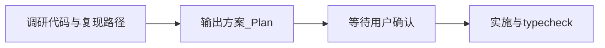

# 先方案后实施（Plan 门禁）

## 铁律

**必须要先出方案，先 plan，再执行；用户说确认才能开始。**

Agent **不得**在未经用户明确确认的情况下，直接改销售/库存/财务的核心单据流程、权限模型，或全局数据层约定。

---

## 何时强制本 Skill

| 场景 | 示例 |
|------|------|
| 单据状态流转 | 销售单审核、出库、作废 |
| 库存数量正确性 | 出入库、盘点、锁定库存 |
| 财务金额 | 应收应付、核销、对账 |
| 权限与数据隔离 | 角色、菜单、数据范围 |
| 用户明确要求 | 「先定方案」「不要直接改」「出 plan」 |

**可跳过 Plan（仍建议简短说明）**：纯 UI（样式/文案/布局）、typo、用户已贴完整方案并说「按这个做」。

---

## 标准流程（必须按序）



### 1. 调研（Research）

- 读相关 Skill、现有 hook / queryKey / store
- 弄清根因与**不改动的边界**
- **禁止**在此阶段写实现代码或「顺手修一下」

### 2. 出方案（Plan）

- 使用 **Plan 模式** 输出可执行方案，包含：
  - 背景与根因
  - 改哪些文件、不改哪些
  - 状态/接口（必要时 mermaid）
  - 边界情况
  - 验证步骤
- **禁止**边写方案边改仓库

### 3. 等待确认（Gate）

仅当用户明确表示以下之一，才可进入实施：

- 「确认」「可以做了」「按方案执行」「Implement the plan」
- 对 Plan 点击确认 / 批准

未确认时：**禁止**改业务代码；可继续答疑、修订方案。

### 4. 实施（Execute）

- 严格按已确认方案的范围改，不擅自扩大
- 完成后对照方案自检；有偏差须在回复中说明

---

## 方案文档建议结构

```markdown
# 标题

## 背景与问题
## 设计原则
## 核心改动（文件路径 + 行为）
## 边界情况
## 验证计划
## 明确不做的项
```

---

## 禁止

- 用户报 bug 后**直接改代码**而不先出 Plan（除非用户明确说「直接修」）
- 用「小改动」绕过确认去动单据状态 / 库存数量 / 金额计算
- 未经确认修改实现，却声称「已按方案完成」
